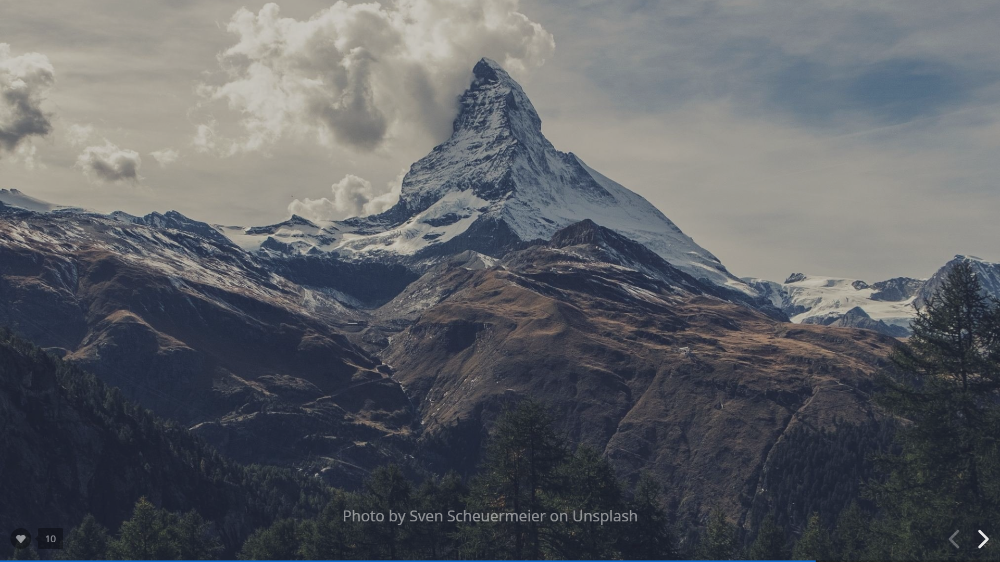
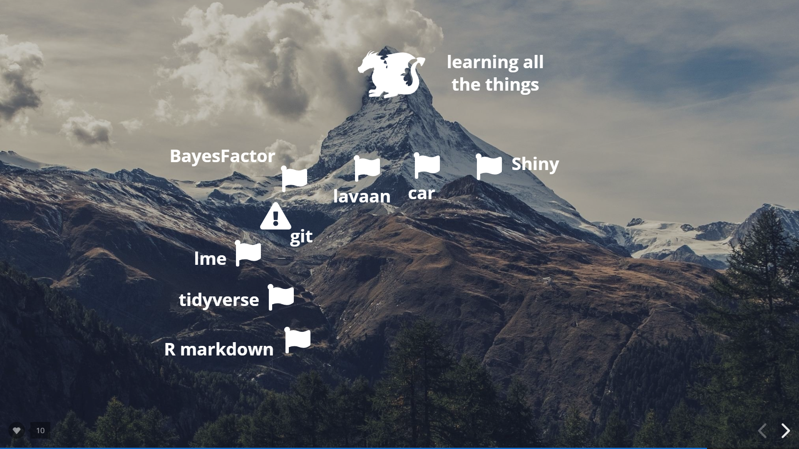

```{r setup, include=FALSE}
options(htmltools.dir.version = FALSE)
episode_counter <- 0
knitr::opts_chunk$set(
  collapse = TRUE,   
  comment = "#>"
)
```

```{r packages, include=FALSE}
library(countdown)
library(here)


```


class: title-slide, center, middle

<span class="fa-stack fa-4x">
  <i class="fa fa-circle fa-stack-2x" style="color: #ffffffcc;"></i>
  <strong class="fa-stack-1x" style="color:#e7553c;">`r rmarkdown::metadata$session`</strong>
</span> 

# `r rmarkdown::metadata$title`

## `r rmarkdown::metadata$subtitle`

### `r rmarkdown::metadata$author` &#183; `r rmarkdown::metadata$institution`

#### [`r params$site_link`](`r params$site_link`)

---
layout: true

<div class="my-footer"><span>`r params$site_link`</span></div>

---

# The Plan

1. Why R?

2. Navigating RStudio

3. Getting your data in

4. Cleaning it up

5. Make a ggplot


--


You will need a laptop and wifi, but we will use RStudio Cloud, so don't worry about installation.

---


---

class: center, middle

# Disclaimer

.pull-left[

#### Today we are really unlikely to know the answers to all your questions, but we can help you google!

#### Google is every R user's best friend, even Hadley Wickham. 


```{r echo=FALSE, out.width= "300px"}
knitr::include_graphics("img/google_hadley.png")
```

]

.pull-right[


```{r echo=FALSE, out.width= "600px"}
knitr::include_graphics("img/google_ResearcHers.png")
```

]


---

class: center, middle, inverse
 
# 1. Why R?

Talk to your neighbour, why do you want to learn R?

```{r echo=FALSE}
countdown(minutes = 2, seconds = 00)
```

---


  
# Why I R...

.pull-left[
### One stop shop 


### [Equity](https://rfortherestofus.com/2019/07/equity/)


### [Reproducibility](https://www.nature.com/articles/s41559-017-0160)


### [Community](https://qz.com/work/1661486/r-ladies-made-data-science-inclusive/)


### Fun!  
 
]

.pull-right[


```{r echo=FALSE, out.width= "1000px"}
knitr::include_graphics("img/stats.jpeg")
```

Image credit Darren Dahly @statsepi

]

---

class: center

# Warning: You will want to quit

```{r echo=FALSE, out.width= "600px"}
knitr::include_graphics("img/pit.jpg")
```

---

class: center

```{r echo=FALSE, out.width= "800px"}

```


Image credit Dani Navarro [Workflow](https://slides.com/djnavarro/workflow#/)

---

class: center

```{r echo=FALSE, out.width= "1000px"}

```

Image credit Dani Navarro [Workflow](https://slides.com/djnavarro/workflow#/)

---

class: center, middle, inverse

# 2.  Navigating RStudio

insert link to RStudio Cloud session here

---

class: center

# Think of R-Studio as your kitchen

```{r echo=FALSE, out.width= "700px"}
knitr::include_graphics("img/studio.jpg")
```

Image credit to Jessica Ward from @RLadiesNCL

---

# Let's start by redecorating

.pull-left[
From the top menu choose
- Tools
- Global Options
- Appearance

Then try out a few Editor themes and choose one you like. 
]

.pull-right[

```{r echo=FALSE, out.width= "600px"}
knitr::include_graphics("img/redecorate.png")
```


```{r echo=FALSE}
countdown(minutes = 4, seconds = 00)
```


]

---

class: center, middle, inverse

# 3. Getting data in

---

class: center, middle, inverse

# 4. Cleaning it up

---

class: center, middle, inverse

# 5. Make a ggplot

---


